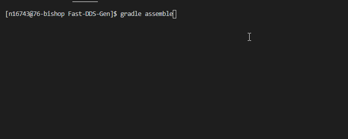

# Sleipnir's Hermod Project

## Section Links

[Hermod - Purpose](#Purpose)

[Hermod - Info](#Important-Info)

[Hermod - Generated Files](#Generated-Files)

[Hermod - Setup](#FastDDS-Setup)

[Hermod - Functional Requirements](#Functional-Requirements)

[Hermod - Known Problems](#Known-Problems)

## Purpose

**Summer 2022 Internship Project**

Project Hermod is a DDS (Distributed Data Service) that models a DDS that would be used for a car system. It utilizes fastDDS framework to create publishers and subscribers to transmit data via topics in real time. Some of the specific component domain being written for the car system are the following:

    - Fuel Domain (Fuel spent, Fuel remaining, Low fuel alert, Miles per gallon, etc..)
    - Miles Domain (Miles traveled, Miles remaining, Miles per gallon, etc..)
    - Trip Domain (Current trip, Trip time, Avg speed, Avg miles per gallon, etc..)

## Important Info

**Runnable Scripts**

- build.sh (Builds both C++ and Python version of the Code)
- lint.sh (Will lint both C++ and Python code for any syntax errors) **Requires that cppcheck and flake8 are installed**
- doc.sh (Will create an HTML Doc of the code for both C++ and Python) **Requires that Doxygen is installed**
- formatcode.sh (Will auto format the Python Code to Pep8 standards) **Requires that autopep8 and clang-format is installed**
- unit-test.sh (Will unit test both C++ and Python code and print the coverage) **Requires that pytest and lcov is installed (Might throw an Internal Error check known problems section if it happens)**
- InstallQemuPackages.sh (Will install QEMU packages from git repo)
- RunQemuEmulation.sh (Takes two args(.iso path, Image name))

## Required Tools and Packages

1. Python v3.8
    - Python Packages
        - signal
        - thread
        - pytest
        - coverage
        - queue
        - sys
        - time
        - random
        - autopep8
        - flake8
        - Json
        - venv (Optional)
2. gcc v11.2.1
3. FastDDS C++/Python
    - Required by FastDDS to install
        - Asio
        - pcre2
        - vcstool
        - softhsm
        - colcon
        - gradle
        - tinyxml2
        - swig
4. Doxygen
5. cppcheck
6. clang-format
7. lcov v1.15-1

## Generated Files

The Files below are generated exclusively by the above scripts

- Here are where you can find the files after the scripts are run
    - C++ Documentation html: `./Vehicle-C++/Vehicle/Build/html/index.html`
    - C++ Coverage html: `./Vehicle-C++/Vehicle/Build/Coverage/index.html`
    - Python Documentation html: `./Vehicle-Python/Build/html/index.html`
    - Python Coverage html: `./Vehicle-Python/Build/Coverage/index.html` **(Error could be caused trying to gen this, read known problems section)**

## FastDDS Setup

The following steps are required to run Hermod.

1. Getting dependencies **(the commands below are assuming your using CentOS 7)**
    - **TinyXml2 v9.0.0**
        - Go to a directory that you want to place all of these download files preferably in the "/home/<userID>/<folder>/" location
        - Run these commands in order.
            - `wget https://github.com/leethomason/tinyxml2/archive/refs/tags/9.0.0.tar.gz`
            - `tar -xvf 9.0.0.tar.gz`
            - `cd tinyxml2-9.0.0`
            - `mkdir build`
            - `cd build/`
            - `sudo cmake3 .. -DCMAKE_INSTALL_PREFIX=/usr/local -DCMAKE_CXX_FLAGS=-fPIC -DCMAKE_C_FLAGS=-fPIC`
            - `sudo cmake3 --build . --target install`
    - **pcre2 v10.23-2 (dependency for swig)**
        - Run these commands
            - `sudo su -l  #enter into root user`
            - `yum install http://mirror.centos.org/centos/7/os/x86_64/Packages/pcre2-utf32-10.23-2.el7.x86_64.rpm`
            - `yum install http://mirror.centos.org/centos/7/os/x86_64/Packages/pcre2-devel-10.23-2.el7.x86_64.rpm`
            - `exit`  #leave root user
    - **OpenSSL & PKCS11 & Softhsm v2.1.0-3 & colcon & vcstool**
        - Directory doesn't matter when installing these dependencies
        - Install these dependencies in order
            - `sudo su -l   `      _#enter root user_
            - `yum install openssl-pkcs11.x86_64`
            - `yum install openssl-devel.x86_64`
            - `yum install http://mirror.centos.org/centos/7/os/x86_64/Packages/softhsm-devel-2.1.0-3.el7.x86_64.rpm`
            - `exit`                _#leave root user_
            - `pip3 install -U colcon-common-extensions vcstool --user`
    - **Gradle v6.9**
        - Directory doesn't matter when installing these dependencies
        - Install these dependencies in order
            - `wget https://services.gradle.org/distributions/gradle-6.9-all.zip`
            - `sudo unzip -d /opt/gradle gradle-6.9-all.zip`
            - `vim ~/.bashrc`    _#Add the next line under the user specific aliases and functions area then exit vim using :wq_
                - `export PATH=$PATH:/opt/gradle/gradle-6.9/bin`
            - `source ~/.bashrc`
            - `gradle -version`    _#To check to see if gradle is working and it version 6.9_
            - `cd /home/<userID>/.gradle`
            - `vim gradle.properties`       _#Enter the next four lines into the properties file this allows gradle to use the northrop proxy_
                - systemProp.https.proxyHost=contractorproxyeast.northgrum.com
                - systemProp.https.proxyPort=80
                - systemProp.http.proxyHost=contractorproxyeast.northgrum.com
                - systemProp.http.proxyPort=80
    - **Cmake3 make default system wide**
        - Use these following commands
            - `sudo alternatives --install /usr/local/bin/cmake cmake /usr/bin/cmake 10 \ --slave /usr/local/bin/ctest ctest /usr/bin/ctest \ --slave /usr/local/bin/cpack cpack /usr/bin/cpack \ --slave /usr/local/bin/ccmake ccmake /usr/bin/ccmake \ --family cmake`
            - `sudo alternatives --install /usr/local/bin/cmake cmake /usr/bin/cmake3 20 \--slave /usr/local/bin/ctest ctest /usr/bin/ctest3 \--slave /usr/local/bin/cpack cpack /usr/bin/cpack3 \--slave /usr/local/bin/ccmake ccmake /usr/bin/ccmake3 \--family cmake`
    - **Asio v1.10**
        - Use this command to install
            - `sudo yum install https://download-ib01.fedoraproject.org/pub/epel/7/x86_64/Packages/a/asio-devel-1.10.8-1.el7.x86_64.rpm`

2. Installing FastDDS C++
    - **FastDDS C++**
        - Please go to a directory where you want to keep all of your library files for FastDDS C++ ex. /home/<userID>/dev/ or /home/<userID>/projects/
        - Use these following commands in order
            - `mkdir FastDDS`
            - `cd FastDDS`
            - `wget https://raw.githubusercontent.com/eProsima/Fast-DDS/master/fastrtps.repos`
            - `mkdir src`
            - `vcs import src < fastrtps.repos`      _#if this command doesn't exist make sure your not in root and you          - have vcstool installed through pip3_
            - `colcon build`      _#If this fails make sure your gcc is version 10.2.1, also make sure Asio is installed_
            - `vim ~/.bashrc`    #Add the next line into your bashrc file
            - `source /home/<location to fast dds folder>/FastDDS/install/setup.bash`   _#make sure to change location to            - the location of the fast dds folder_
            - `source ~/.bashrc`
    - **FastDDS-Gen**   _#Note: If you already installed fastdds-gen then you can skip this step_
        - Please put this in the same dir as the FastDDS so they are next to each other
        - Use these following commands in order
            - `git clone --recursive https://github.com/eProsima/Fast-DDS-Gen.git`
            - `cd Fast-DDS-Gen`
            - `gradle assemble`
            - `vim ~/.bashrc`  #Add the next line into your bashrc file
            - `export PATH=$PATH:/home/<Location to your Fast-DDS-Gen folder>/Fast-DDS-Gen/scripts`     _#make sure to put in your fast dds gen folder location_
            
    
        You should be able to run the C++ version of Hermod, if you would like to create your own file from scratch you can checkout this link: [FastDDS C++ Example](https://fast-dds.docs.eprosima.com/en/latest/fastdds/getting_started/simple_app/simple_app.html)
        
3. Install FastDDS Python
    - **FastDDS Python**
        - Please go to a directory where you want to keep all of your library files for FastDDS Python ex. /    home/<userID>/dev/ or /home/<userID>/projects/
        - Use these following commands in order
            - `mkdir FastDDS-Python`
            - `cd FastDDS-Python`
            - `wget https://raw.githubusercontent.com/eProsima/Fast-DDS-python/main/fastdds_python.repos`
            - `mkdir src`
            - `vcs import src < fastdds_python.repos`     _#if this command doesn't exist make sure your not in   root and            - you have vcstool installed through pip3_
            - `colcon build`      _#If this fails make sure your gcc is version 10.2.1, also make sure Asio is    installed,           - and make sure python38-devel is installed_
            - `vim ~/.bashrc`    _#Add the next line into your bashrc file_
            - s`ource /home/<location to fast dds python folder>/FastDDS-Python/install/setup.bash`   _#make  sure to change         - location to the location of the fast dds folder_
            - `source ~/.bashrc`
    - **Fixes**
        - **Fix for FastDDS.py not found**
            - Copy all the files from `/home/<location to FastDDS-Python>/install/fastdds_python/lib64/python3.8/site-packages` and move them to `/home/<userID>/.local/lib/python3.8/site-packages/`
            - `cp -r /home/<location to FastDDS-Python>/install/fastdds_python/lib64/python3.8/site-packages/* /home/<userID>/.local/lib/python3.8/site-packages/`

## Functional Requirements
What follows are the functional requirements set by the client, which were later refined and changed.

Number of Topics: 5
Number of Exclusively Publishers: 2
Number of Exclusively Subscribers: 5
Number of Multi-Subscribers and Single Subscribers: 3

**1. System Level Requirements:**

    System:
        - The vehicle shall display a visible indicator to the driver when the vehicle is projected to run out of fuel within 5 liters or less from the Low Fuel Alert Monitor.
        - The vehicle shall display to the driver the amount of fuel remaining in liters from the tank as a percentage from the Fuel Gauge.
        - The vehicle shall display average miles per gallon to the driver from the Miles Per Gallon.
        - The vehicle shall display the selected road trip of miles traveled to the driver from the Road Trip Meter.

**2. Publisher Requirements:**

    Fuel Sensor:
        - The Fuel Sensor shall measure the amount of fuel remaining in liters every 0.25 seconds.
        - The Fuel Sensor shall publish amount of fuel remaining in liters to the Fuel Remaining Topic every 0.25 seconds.
        - The Fuel Sensor shall determine the amount of fuel spent in liters every 0.25 seconds.
        - The Fuel Sensor shall publish the amount of fuel spent in liters to the Fuel Spent Topic every 0.25 seconds

    Button Sensor:
        - The Button Sensor shall read the user input of the amount of time in seconds the button was pushed.
        - The Button Sensor shall publish the button input in seconds to the Road Trip Meter Topic whenever the user inputs.

**3. Subscriber Requirements:**

    Distance Display:
        - The Distance Display shall receive miles traveled from the Miles Traveled Topic.
        - The Distance Display shall always display miles traveled to the dashboard.

    Miles Left Until Refuel:
        - The Miles Left Until Refuel shall receive miles per gallon from the Miles Per Gallon Topic.
        - The Miles Left Until Refuel shall receive fuel remaining from the Fuel Remaining Topic.
        - The Miles Left Until Refuel shall calculate miles remaining using miles per gallon and fuel remaining.
        - The Miles Left Until Refuel shall display miles remaining every 0.25 seconds.

    Miles Per Gallon Monitor:
        - The Miles Per Gallon Monitor shall receive miles per gallon from the Miles Per Gallon Topic.
        - The Miles Per Gallon Monitor shall display miles per gallon of the vehicle every 0.25 seconds.

    Fuel Gauge:
        - The Fuel Gauge shall receive fuel remaining in liters from the Fuel Remaining Topic.
        - The Fuel Gauge will calculate fuel remaining percentage using fuel remaining and tank capacity.
        - The Fuel Gauge shall display fuel remaining percentage every 0.25 seconds.

    Low Fuel Alert Monitor:
        - The Low Fuel Alert Monitor shall receive miles remaining from the Fuel Remaining Topic.
        - The Low Fuel Alert Monitor shall display a Low Fuel Indicator to the Dashboard when the projected fuel remaining is 5 litters or less.
        - Once the Low Fuel Indicator has turned on, the Low Fuel Alert Monitor shall remain on display until the projected Fuel remaining is more than 5 litters.

**4. Pub/Sub Requirements:**

    Miles Per Gallon:
        - Miles Per Gallon shall receive fuel spent in liters from the Fuel Spent Topic.
        - Miles Per Gallon shall receive miles traveled from the Miles Traveled Topic.
        - Miles Per Gallon shall calculate miles per gallon using miles traveled and fuel spent.
        - Miles Per Gallon shall publish miles per gallon to its subscribers every 0.25 seconds.

    Miles Traveled Sensor:
        - The Miles Traveled Sensor shall measure the amount of miles traveled every 0.25 seconds.
        - The Miles Traveled Sensor shall publish miles traveled to the Miles Traveled Topic every 0.25 seconds.
        - The Miles Traveled Sensor shall stop and print its final value after the fuel sensor reaches zero fuel remaining.

    Road Trip Meter:
        - The Road Trip Meter shall receive the amount of miles traveled from the Miles Traveled topic every 0.25 seconds.
        - The Road Trip Meter shall receive the the button input from the Road Trip Meter Topic asynchronously.
        - The Road Trip Meter shall increment the amount of miles traveled onto the miles traveled of Trip 1 and Trip 2.
        - The Road Trip Meter shall publish the trip miles traveled of the currently selected trip number to its subscribers every 0.25 seconds.
        - The Road Trip Meter shall determine from the button input to do either of the following:
            - Reset the trip miles traveled to the trip number that is currently selected.
            - Switch the trip number that is currently being published to its subscribers.

**5. Topic Requirements:**

    Fuel Remaining Topic:
        - The Fuel Remaining Topic shall receive fuel remaining from the Fuel Sensor.
        - The Fuel Remaining Topic shall publish only fuel remaining to its subscribers every 0.25 seconds.

    Fuel Spent Topic:
        - The Fuel Spent Topic shall receive fuel spent from the Fuel Sensor.
        - The Fuel Spent Topic shall publish fuel spent to its subscribers every 0.25 seconds.

    Miles Remaining Topic:
        - The Miles Traveled Topic shall receive miles traveled from the Miles Sensor.
        - The Miles Traveled Topic shall publish only miles traveled to its subscribers every 0.25 seconds.

    Miles Per Gallon Topic:
        - The Miles Traveled Topic shall receive miles traveled from the Miles Sensor.
        - The Miles Traveled Topic shall publish only miles traveled to its subscribers every 0.25 seconds.

    Miles Per Gallon Topic:
        - The Miles Per Gallon Topic shall receive miles per gallon from the Miles Per Gallon.
        - The Miles Per Gallon Topic shall publish miles per gallon to its subscribers.

    Road Trip Meter Topic:
        - The Road Trip Meter Topic shall receive the button input from the Button Sensor.
        - The Road Trip Meter Topic Topic shall publish the button input to its subscribers.

## Design Constraints

What follows are the design constraints determined by the team to carry out the functional requirements.

**Fuel Sensor Implementation Requirements:**

    Fuel Sensor shall send:
        - Message Index (unsigned integer)
        - Liters Remaining (double)
        - Liters Spent (double)
    Fuel Sensor shall force other sensors to read 0.0 for none index values until it Fuel Sensor start.

**Miles Sensor Implementation Requirements:**

    Miles Traveled Sensor shall send:
        - Message Index (unsigned integer)
        - Cumulative Miles Traveled (double)

**Miles Per Gallon Implementation Requirements:**

    Miles Per Gallon shall send:
        - Message Index (unsigned integer)
        - Cumulative Miles Per Gallon (double)

**Miles Left Until Refuel Implementation Requirements:**

    Miles Left Until Refuel shall send:
        - Message Index (unsigned integer)
        - Miles Left Until Refuel (double)

**Low Fuel Alert Monitor Implementation Requirements:**

    Low Fuel Alert Monitor shall send:
        - Message Index (unsigned integer)
        - Is Fuel Low (signed integer) (treat as bool)

**Road Trip Meter Implementation Requirements:**

    Button Sensor shall send:
        - Message Index (unsigned integer)
        - Button Pressed in seconds (unsigned integer)
    Road Trip shall send:
        -The current trip number being displayed (string) (i.e. Trip #)
        - Road Trip of miles traveled (unsigned integer)

**Standard Protocol:**
    Subscribers:
        - When a Subscriber disconnects: A Publisher will continue writing even if there were no initial Subscribers.
    Publishers:
        - When a Publisher disconnects: a Subscriber will contnue to read an error value even if there were no initial Publishers.
            - For the double value, it will be -1.0
            - For the integer value, it will be -1

## Known Problems

INTERNALERROR Unsupported hash type(Python)
- If you try to run the unit-test.sh script and it throws and error about INTERNALERROR unsupported hash type then this is a problem with openssl binding with python. To fix this you can uninstall python and openssl and bind them together(Research is needed for this). The method we used was to change two lines of code in the site-packages from the files `/home/<user>/.local/lib/python3.8/site-packages/coverage/misc.py line 226` and `/home/n16743/.local/lib/python3.8/site-packages/coverage/files.py line 95` and change the strings that say sha3_256 to sha256. If you don't want to fix this you can just comment out line 14 in unit-testing.sh and uncomment line 15 which will just show what lines weren't hit during the test.
