# Sleipnir's Hermod Design Docs

These are the diagrams we created to map out our plan to create each publisher and subscriber for Hermod.

## Diagrams

In this section, you will find all of the diagrams that were produced for the documentation. This should allow you to better visualize some of the requirements presented.

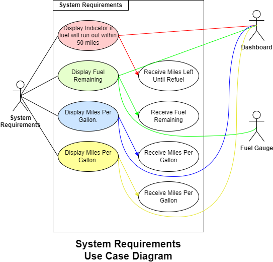
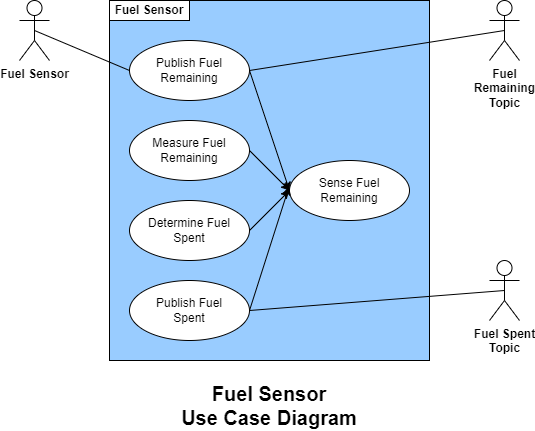
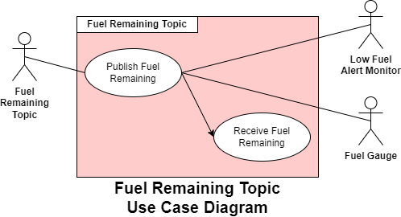
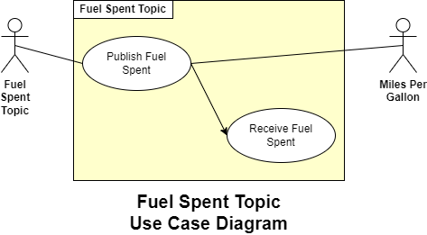

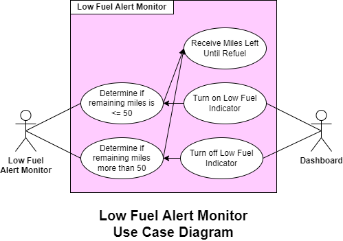
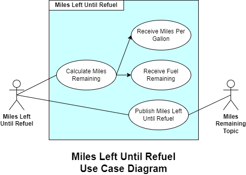
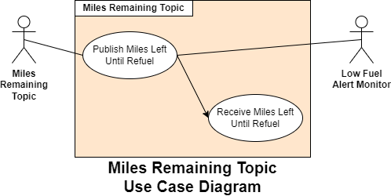
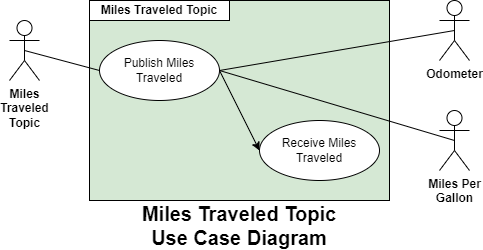
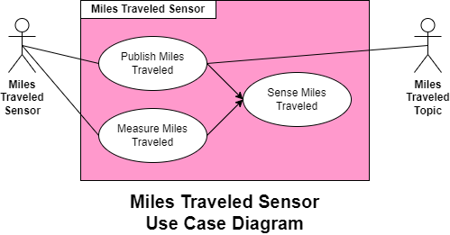
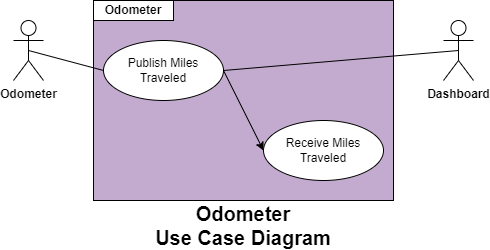
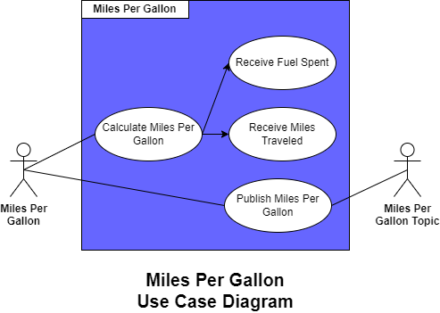
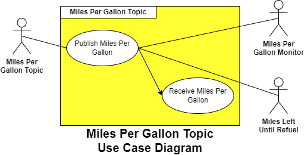
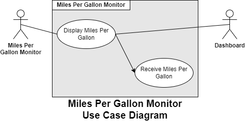
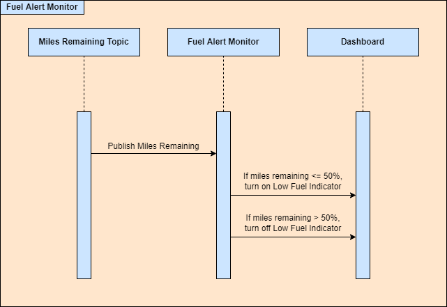
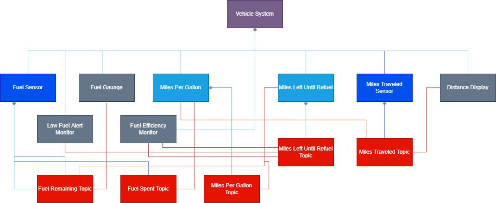